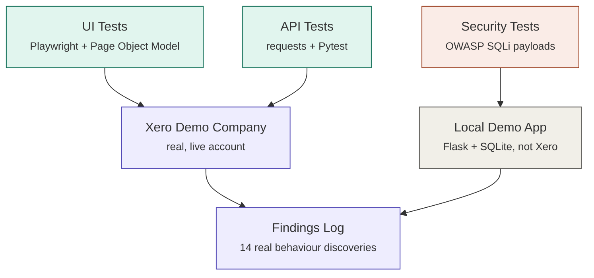

# Xero Test Automation & QA Engineering Portfolio Project

**A three-layer test automation suite — UI (Playwright), API (Pytest + requests), and security (OWASP SQL injection) — built end-to-end against a real, live Xero Demo Company, with every locator and edge case verified against the actual system rather than assumed from documentation.**

> Author: Sneha Umrikar · Software Testing & QA Engineering
> [Findings Log](#findings--real-xero-behaviour-discovered-through-testing) · [AI-Assisted Testing](#ai-assisted-testing)

---

## Table of Contents

1. [Project Overview](#project-overview)
2. [Why Xero](#why-xero)
3. [Tech Stack](#tech-stack)
4. [Architecture](#architecture)
5. [Testing Layers](#testing-layers)
6. [Findings — Real Xero Behaviour Discovered Through Testing](#findings--real-xero-behaviour-discovered-through-testing)
7. [AI-Assisted Testing](#ai-assisted-testing)
8. [Design Decisions Worth Explaining](#design-decisions-worth-explaining)
9. [Repository Structure](#repository-structure)
10. [How to Run This Project](#how-to-run-this-project)

---

## Project Overview

Most QA portfolio projects test a static demo app the author fully controls, so every locator, every validation rule, and every edge case behaves exactly as expected on the first try. That's a poor rehearsal for real QA work, where the system under test is someone else's, changes without notice, and frequently disagrees with what the documentation implies.

This project deliberately does the harder version: it tests **Xero's real Demo Company** — a live, production-grade accounting platform with MFA-protected login, bot detection, dynamic per-organisation URLs, and undocumented validation quirks — across three layers:

- **UI automation** (Playwright, Page Object Model) — the full login → invoice → reconcile → report journey
- **API testing** (Python `requests` + Pytest) — direct calls against Xero's real Accounting API, with OAuth2 handled automatically
- **Security testing** (OWASP SQL Injection Prevention Cheat Sheet) — a self-built vulnerable-vs-parameterized comparison app, proving *why* a defence works, not just that Xero itself is safe

Every locator in this repository was either confirmed directly from a real Playwright error log or flagged honestly as unverified rather than guessed a second time. **14 real discrepancies** between reasonable assumptions and Xero's actual behaviour were found, documented, and resolved or explicitly left open — see the [Findings table](#findings--real-xero-behaviour-discovered-through-testing) below.

---

## Why Xero

Xero was chosen deliberately over a purpose-built practice app:

- **Real complexity, not a tutorial sandbox.** MFA, bot detection, OAuth2, and a modern single-page-app frontend are exactly the obstacles a QA engineer meets on a real project — and each one required a genuine debugging process to solve, documented below rather than hidden.
- **A public, free Demo Company** with realistic financial data (invoices, contacts, bank transactions), so no synthetic dataset had to be built to get meaningful test coverage.
- **A real, documented API** alongside the UI, making it possible to build a proper UI-to-data cross-validation test — verifying a number shown on a report page matches an independently-computed total from the API, the same principle used to validate a BI dashboard against its underlying warehouse query.

---

## Tech Stack

| Layer | Tools |
|---|---|
| **UI automation** | Playwright (Python), Page Object Model |
| **API testing** | Python `requests`, Pytest, OAuth2 (Custom Connection / client credentials grant) |
| **Security testing** | Flask + SQLite (self-built vulnerable-vs-safe demo), OWASP SQL Injection Prevention Cheat Sheet |
| **Test design** | ISTQB techniques — equivalence partitioning, boundary value analysis |
| **Data-driven testing** | `@pytest.mark.parametrize`, `pytest.mark.xfail` for documented known-gap findings |
| **Manual/exploratory testing** | Postman (collection mirrors the automated API suite) |
| **AI-assisted QA** | Claude (Anthropic) for test case generation, with every suggestion manually reviewed before use |
| **CI/CD** | GitHub Actions (separate jobs for fast API/security tests vs. scheduled UI runs) |
| **System under test** | Xero Accounting API + Demo Company (live) |

---

## Architecture



UI and API tests both target the same real Xero Demo Company, through two different doors — a browser and a direct HTTP client. Security tests deliberately target a separate, self-built local app instead, so the vulnerability and its fix are both directly observable rather than only proving Xero's backend is well-built.

---

## Testing Layers

### UI Automation
Full journey — login (via a manually-authenticated, saved session that survives Xero's MFA requirement), create invoice, approve, void, reconcile, and cross-check a report total. Built with a proper Page Object Model (`pages/`): actions and state queries live in page objects, assertions live only in test files, and every navigation goes through real UI clicks rather than a guessed direct URL, since Xero embeds per-organisation IDs in most of its screen URLs.

### API Testing
Direct calls against Xero's real Accounting API using a Custom Connection (client-credentials OAuth2 — no browser login, no refresh token management). Test design applies ISTQB boundary value analysis and equivalence partitioning explicitly: `@pytest.mark.parametrize` runs the same test against a valid-typical amount, a valid boundary, an invalid boundary, and an invalid value, with each case labelled by which partition it represents.

### Security Testing
A self-built Flask + SQLite app with two versions of the same search feature — one vulnerable to SQL injection via string concatenation, one safe via parameterized queries — tested with the same OWASP-derived payload set against both. This proves the defence mechanism is understood, not just that a well-built third-party system happens to resist a copy-pasted payload list.

---

## Findings — Real Xero Behaviour Discovered Through Testing

None of these were known upfront. Each was found by writing a test based on a reasonable assumption, running it against the real Demo Company, and following up when reality disagreed.

| # | Assumption Tested | What Xero Actually Does |
|---|---|---|
| 1 | A zero or negative invoice amount would be rejected | **Accepted silently** — even calculates tax on a negative amount. Flagged as a data-quality risk via `xfail`, not silently treated as expected |
| 2 | `Total` = sum of line-item amounts | **Tax is auto-added** unless `TaxType: "NONE"` is explicitly set |
| 3 | Any invoice can be voided | **Only AUTHORISED/SUBMITTED** invoices can be voided — a DRAFT invoice must be deleted instead |
| 4 | AUTHORISED invoices behave the same as DRAFT | **A DueDate is required** once Status is AUTHORISED, but not for DRAFT |
| 5 | An amount with more than 2 decimal places would be rejected | **Rounded to the nearest cent** (round-half-up), not rejected or truncated — confirmed with a dedicated automated test, not just a note |
| 6 | Contact.Name has some length limit | **Exactly 255 characters** — confirmed both sides of the boundary (255 accepted, 256 rejected with an explicit UI message) |
| 7 | Emoji-only contact names might be rejected | **Accepted** without any validation error |
| 8 | UnitAmount sent as a JSON string would behave predictably | **Deliberately left open** — UI input masking blocks typing a string, which says nothing about the API's own JSON parsing behaviour. Documented as unresolved rather than guessed |
| 9 | A direct URL can jump straight to a specific screen (e.g. bank reconciliation) | **Fails or redirects** — Xero embeds per-organisation/per-account IDs in these URLs; every page object navigates via real UI clicks instead |
| 10 | A "New" button on the dashboard is unambiguous | **Two elements matched** under Playwright's default substring matching — the error log itself named both, which is how the correct one was identified without guessing |
| 11 | `wait_for_load_state("networkidle")` is a safe generic "page ready" wait | **Times out on modern SPAs** — Xero keeps background connections open indefinitely, so the network never goes fully idle even though `load` fires normally |
| 12 | The Reconcile control is a link with fixed text "Reconcile" | **It's a button**, with a live item count baked into the accessible name (`"Reconcile 20 items"`) — confirmed via `codegen`, matched with a regex instead of an exact string |
| 13 | Short labels like `"To"` are safe to match without exact-matching | **Substring matching turned a 2-letter label into 8 false-positive matches** against unrelated navigation elements — fixed pre-emptively across every short locator in the suite, not just the one that failed |
| 14 | A test can invent its own reference string and expect a matching bank transaction to exist | **Nothing creates that transaction** — real reconciliation matches *existing* records; a fabricated reference was a test design flaw, not a locator bug. Marked `skip` with the honest reason rather than chased with more selector guesses |

---

## AI-Assisted Testing

Two AI-assisted workflows, each with the review step made visible rather than hidden:

- **Test case generation** — Claude was prompted to suggest edge cases beyond the hand-written boundary tests (e.g. sub-cent amounts, Unicode names, field-length boundaries). Every suggestion was manually reviewed before use: some were accepted, some were explicitly marked "ambiguous" and later resolved through direct manual testing (findings #6, #7, #8 above), converting them from `pytest.skip()` into real assertions only once confirmed.
- **Data verification** — a second-pass, advisory anomaly check (near-duplicate contact names, mismatched descriptions) applied *after* deterministic data-quality rules, never replacing them.

The claim here isn't "AI wrote the tests" — it's that AI widened the net of candidate edge cases, and the same judgement a tester always applies decided what was real, what needed verification, and what was ultimately unresolved.

---

## Design Decisions Worth Explaining

**Why UI tests reuse a saved session instead of scripting the login form.** Xero enforces MFA, which requires a live authenticator code — unscriptable without either the MFA secret itself or accepting a human logs in occasionally. A human authenticates once; Playwright's `storage_state` persists that session for every test afterward. This is a standard pattern for automating any MFA-protected system, not a workaround unique to this project.

**Why the security suite runs locally, not against Xero's live UI.** Firing SQL injection payloads at Xero's real form fields would only prove Xero's backend is well-built — it wouldn't prove an understanding of *why* an injection succeeds or *why* a specific defence stops it.

**Why UI tests run on a schedule, not on every push.** A full browser login is slower and more failure-prone than an API call, and Xero enforces usage limits — a deliberate CI design choice, not a missing feature.

**Why test data is UUID-suffixed with teardown cleanup, not a reset endpoint.** Testing against a real, shared, stateful system means there's no way to wipe it between runs. Isolation instead comes from every test creating uniquely-named records and a cleanup fixture archiving or voiding whatever was created, regardless of pass/fail.

---

## Repository Structure

```
xero-test-automation/
├── pages/                     # Page Object Model
│   ├── base_page.py
│   ├── login_page.py
│   ├── invoice_page.py
│   ├── reconciliation_page.py
│   └── reports_page.py
├── tests/
│   ├── ui/                    # Playwright journey tests
│   ├── api/                   # Requests + Pytest against the real Xero API
│   └── security/              # SQL injection suite (local vulnerable-vs-safe demo)
├── postman/                   # Postman collection mirroring the API tests
├── ai_assisted_testing/       # AI-assisted test case generation + data verification
├── fixtures/conftest.py       # Shared fixtures: token manager, API client, test isolation
├── utils/
│   ├── xero_auth.py           # OAuth2 Custom Connection token handling
│   └── api_client.py          # Xero API client wrapper
├── security_demo/app.py       # Local Flask+SQLite vulnerable-vs-safe demo
├── save_auth_state.py         # One-time manual login (MFA) -> saved session
├── .github/workflows/tests.yml
├── .env.example
└── requirements.txt
```

---

## How to Run This Project

**1. Clone the repository**
```bash
git clone https://github.com/umrikars/xero-test-automation.git
cd xero-test-automation
```

**2. Install dependencies**
```bash
python3 -m venv venv
source venv/bin/activate
pip install -r requirements.txt
playwright install chromium chrome
```

**3. Run the security suite — no credentials needed**
```bash
pytest tests/security -v
```

**4. Get Xero API credentials (Custom Connection — no browser OAuth flow needed)**

Register an app at [developer.xero.com/app/manage](https://developer.xero.com/app/manage/) as a **Custom connection**, authorise it against your Demo Company, and copy `.env.example` to `.env` with your `XERO_CLIENT_ID` / `XERO_CLIENT_SECRET`.

**5. Run the API suite against the real Demo Company**
```bash
pytest tests/api -v
```

**6. Authenticate once for the UI suite (handles MFA)**
```bash
python save_auth_state.py
```

**7. Run the UI suite**
```bash
pytest tests/ui -v
```

Full setup detail, including the Custom Connection walkthrough and MFA session-refresh process, is in the repository's technical README.
